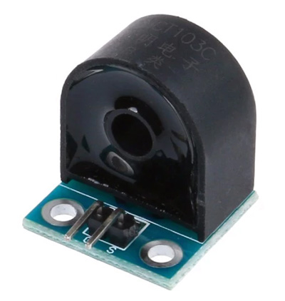

# Wood-Cleaner
Steuerung für eine Absauganlage für zwei Absaugmotoren und maximal 8 Automatik-Steckdosen. Die Blast-Gates werden per Servo angesteuert. Beim Einschalten eines Holzbearbeitungswerkzeugs wird die Stromaufnahme erfasst, die jeweilige Luftklappe aufgefahren und die Absaugung eingeschaltet. Beim Auschalten soll es eine Nachlaufzeit geben und anschließend die Klappe zu gefahren werden.

Entwickler: Andreas Stäcker

## Bauteile
**Wechselstrom-Sensor ZMCT103C** für die automatik Steckdosen  
  
[Link - AliExpress](https://de.aliexpress.com/item/4000109096239.html?spm=a2g0o.cart.0.0.5e623c00Nbqb04&mp=1)  
<a href="sheats\ZMCT103C-ETC.pdf"    target="_blank">Datenblatt ZMCT103C</a> 
 
**Gleichstrom-Sensor ACS712 5A** für die Servo Überwachung  
  
[Link - AliExpress](https://de.aliexpress.com/item/1005001621770833.html?spm=a2g0o.productlist.0.0.299a7696HSPonL&algo_pvid=d9741e3f-fb27-4cfa-abb0-c8a1d19072a9&algo_expid=d9741e3f-fb27-4cfa-abb0-c8a1d19072a9-2&btsid=2100bb5116069941127795617e1153&ws_ab_test=searchweb0_0,searchweb201602_,searchweb201603_)  
<a href="sheats\ACS712_AllegroMicroSystems.pdf"    target="_blank">Datenblatt ZMCT103C</a>  
   
  
 **5V Relais 10A** für das Schalten der Staubsauger/Absaugmotoren  
  
[Link - Amazon](https://www.amazon.de/dp/B08G16L654/ref=cm_sw_em_r_mt_dp_CSmYFb4KV8GE4)  

 
## Fotos

Prototype Blastgate

Verwendete Servos

## Linksammlung
